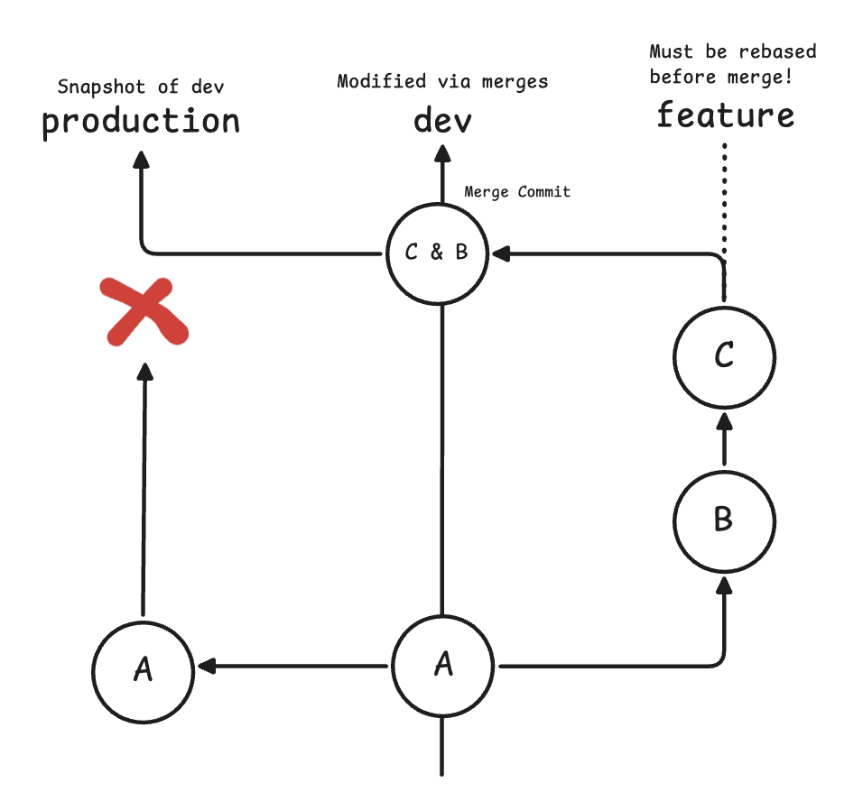

# Workflow

Git workflow for current repository is based on Trunk Based Development. We push
often, sometimes the state is incomplete, but this allows us to move
incrementally really fast. We avoid big feature branches and separate one
feature-request into multiple small PRs.

## dev

Dev is our main branch. We merge everything there. Only merges are allowed to
dev branch.

## feature

Feature branches are created from dev and they must be **rebased** if conflicts
arise. Do not merge to solve conflicts.

## production

Production is generally a snapshot of dev branch when we think dev is ready for
release. We **rebase** production onto dev to avoid commits clutter.

## hotfix

Sometimes we need to fix production branch directly without receiving all
changes that are currently in dev. In that case, we do the following:

* Create a hotfix branch **from production branch**
* Rebase production onto hotfix branch via PR
* Merge hotfix commit via cherry-pick in a second PR 

We create 2 branches so after production is rebased onto dev, production will
not be ahead of dev by some comments.

## Image

